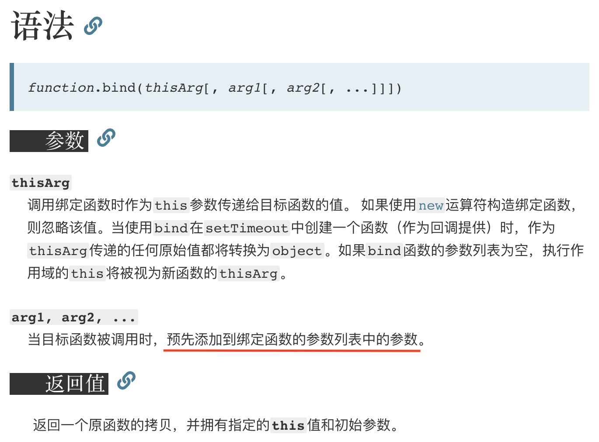
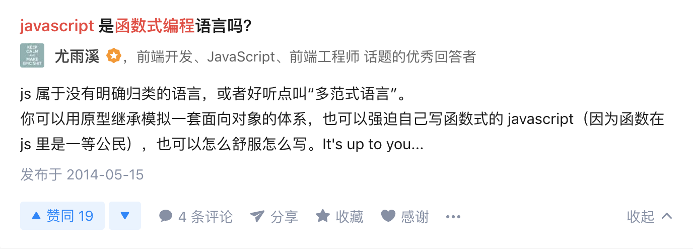

# half-fp-js: pointfree-js 🐶

half 的原因：

* 另外一半看不懂
* 因为纯函数要避免副作用，对于前端经常操作 DOM 可能比较严格（现在使用框架让框架处理 DOM 部分，还是可行的）
* pointfree 部分在使用原生 JS 时使用场景还是挺多的

## 一个简单的例子

我们从一个愚蠢的例子开始。鸟群合并则变成了一个更大的鸟群，繁殖则增加了鸟群的数量，增加的数量就是它们繁殖出来的鸟的数量。注意这个程序并不是面向对象的良好实践，它只是强调当前这种变量赋值方式的一些弊端。

```js
// 鸟群
class Flock {
  constructor(n) {
    this.seagulls = n
  }
  // 合并
  conjoin(other) {
    this.seagulls += other.seagulls
    return this
  }
  // 繁殖
  breed(other) {
    this.seagulls = this.seagulls * other.seagulls
    return this
  }
}

const flockA = new Flock(4)
const flockB = new Flock(2)
const flockC = new Flock(0)
const result = flockA
  .conjoin(flockC)
  .breed(flockB)
  .conjoin(flockA.breed(flockB)) // 内部状态被改变
  .seagulls
// 32
```

如果你看不懂这个程序，没关系，我也看不懂。重点是状态和可变值非常难以追踪，即便是在这么小的一个程序中也不例外。

试试另一种更函数式的写法：

```js
const conjoin = (flockX, flockY) => flockX + flockY;
const breed = (flockX, flockY) => flockX * flockY;

const flockA = 4;
const flockB = 2;
const flockC = 0;
const result =
    conjoin(breed(flockB, conjoin(flockA, flockC)), breed(flockA, flockB))
// 16
```

我们把它们重命名一下，看看它们的真面目。

```js
const add = (x, y) => x + y;
const multiply = (x, y) => x * y;

const flockA = 4;
const flockB = 2;
const flockC = 0;
const result =
    add(multiply(flockB, add(flockA, flockC)), multiply(flockA, flockB))
// 16
```

这么一来，你会发现我们不过是在运用早已获得的知识：

```js
// 结合律（assosiative）
add(add(x, y), z) === add(x, add(y, z))

// 交换律（commutative）
add(x, y) === add(y, x)

// 同一律（identity）
add(x, 0) === x

// 分配律（distributive）
multiply(x, add(y,z)) === add(multiply(x, y), multiply(x, z))
```

运用这些定律简化这个海鸥小程序：

```js
// 原有代码
add(multiply(flockB, add(flockA, flockC)), multiply(flockA, flockB))

// 应用同一律，去掉多余的加法操作（add(flockA, flockC) == flockA）
add(multiply(flockB, flockA), multiply(flockA, flockB))

// 再应用分配律
multiply(flockB, add(flockA, flockA))
```

> ## 普通公民的函数
> 
> 当我们说函数是“一等公民”的时候，我们实际上说的是它们和其他对象都一样...所以就是普通公民（坐经济舱的人？）。JS 中函数真没什么特殊的，你可以像对待任何其他数据类型一样对待它们——把它们存在数组里，当作参数传递，赋值给变量...等等。
> 
> ```js
> const hi = name => `Hi ${name}`
> const greeting = name => hi(name)
> 
> hi('there') // 'Hi there'
> greeting('there') // 'Hi there'
> ```
> 
> 这里 greeting 指向的那个把 hi 包了一层的包裹函数完全是多余的
> 
> ```js
> const greeting = hi
> ```
> 
> 换句话说，hi 已经是个接受一个参数的函数了，为何要再定义一个额外的包裹函数，而它仅仅是用这个相同的参数调用 hi？完全没有道理。这就像在大夏天里穿上你最厚的大衣，只是为了跟热空气过不去，然后吃上个冰棍。真是脱裤子放屁多此一举。
> 
> 我们再来看几个例子。以下代码都来自 npm 上的模块包：
> 
> ```js
> // 太傻了
> const getServerStuff = callback => ajaxCall(json => callback(json));
> 
> // 这才像样
> const getServerStuff = ajaxCall;
> ```
> 
> 世界上到处都充斥着这样的垃圾 ajax 代码。以下是上述两种写法等价的原因：
> 
> ```js
> // 这行
> ajaxCall(json => callback(json));
> 
> // 等价于这行
> ajaxCall(callback);
> 
> // 那么，重构下 getServerStuff
> const getServerStuff = callback => ajaxCall(callback);
> 
> // ...就等于
> const getServerStuff = ajaxCall // <-- 看，没有括号哦
> ```
> 
> 项目中常见的一种造成混淆的原因是，针对同一个概念使用不同的命名。还有通用代码的问题。比如，下面这两个函数做的事情一模一样，但后一个就显得更加通用，可重用性也更高：
> 
> ```js
> // 只针对当前的博客
> const validArticles = articles =>
>   articles.filter(article => article !== null > && article !== undefined);
> // 对未来的项目更友好
> const compact = xs => xs.filter(x => x !== > null && x !== undefined);
> ```
> 
> 在命名的时候，我们特别容易把自己限定在特定的数据上（本例中是 articles）。
> 
> 有一点我必须得指出，你一定要非常小心 this 值，别让它反咬你一口，这一点与面向对象代码类似。如果一个底层函数使用了 this，而且是以一等公民的方式被调用的，那你就等着 JS 这个蹩脚的抽象概念发怒吧。
> 
> ```js
> var fs = require('fs');
> 
> // 太可怕了
> fs.readFile('freaky_friday.txt', Db.save);
> 
> // 好一点点
> fs.readFile('freaky_friday.txt', Db.save.bind(Db));
> ```
> 
> 把 Db 绑定（bind）到它自己身上以后，你就可以随心所欲地调用它的原型链式垃圾代码了。this 就像一块脏尿布，我尽可能地避免使用它，因为在函数式编程中根本用不到它。然而，在使用其他的类库时，你却不得不向这个疯狂的世界低头。
> 
> 也有人反驳说 this 能提高执行速度。如果你是这种对速度吹毛求疵的人，那你还是合上这本书吧。要是没法退货退款，也许你可以去换一本更入门的书来读。
> 
> 至此，我们才准备好继续后面的章节。

## 纯函数

> 纯函数是这样一种函数，即`相同的输入，永远会得到相同的输出`，而且`没有任何可观察的副作用`。

纯函数就是数学上的函数

我们说 slice 符合纯函数的定义是因为对相同的输入它保证能返回相同的输出。而 splice 却会嚼烂调用它的那个数组，然后再吐出来；这就会产生可观察到的副作用，即这个数组永久地改变了。

"immutable"

> 副作用是在计算结果的过程中，系统状态的一种变化，或者与外部世界进行的可观察的交互。

副作用可能包含，但不限于：

* 更改文件系统
* 往数据库插入记录
* 发送一个 http 请求
* 可变数据
* 打印/log
* 获取用户输入
* DOM 查询
* 访问系统状态

这并不是说，要禁止使用一切副作用，而是说，要让它们在可控的范围内发生。如何控制它们：`functor` 和 `monad`

## 柯里化（curry）

> 只传递给函数一部分参数来调用它，让它返回一个函数去处理剩下的参数。

```js
const add = x => y => x + y
```

这就是一个柯里化的 +，但是有个问题，最后再说

更加通用的实现：

用 bind 可以很方便的实现

> MDN：bind()方法创建一个新的函数，在bind()被调用时，这个新函数的this被bind的第一个参数指定，其余的参数将作为新函数的参数供调用时使用。

函数式编程中不用 this，我们把关于 this 的部分忽略：

bind 方法创建一个新的函数，在 bind 被调用时，~~除第一个参数以外的~~参数将作为新函数的参数供调用时使用。

嗯，有柯里化内味



```js
// curry :: ((a, b, ...) -> c) -> a -> b -> ... -> c
function curry(fn) {
  const arity = fn.length

  return function $curry(...args) {
    if (args.length < arity) {
      return $curry.bind(null, ...args)
    }

    return fn.call(null, ...args)
  }
}
```

```js
const curry = (fn, arity = fn.length, ...args) =>
  arity <= args.length ? fn(...args) : curry.bind(null, fn, arity, ...args)
```

## 组合（compose）

多个函数组合出一个新的函数

```js
const simpleCompose = (f, g) => x => f(g(x))
```

在 compose 的定义中，g 将先于 f 执行，因此就创建了一个`从右到左`的数据流。

```js
const compose = (...fns) => fns.reduce((f, g) => (...args) => f(g(...args)))
```

从右向左执行更加能够反映数学上的含义——组合的概念直接来自于数学课本。实际上，所有的组合都有一个特性：

结合律

```js
// associativity
compose(f, compose(g, h)) === compose(compose(f, g), h);
```


例子：

```js
const toUpperCase = s => s.toUpperCase()
const exclaim = s => `${s}!`
const shout = compose(exclaim, toUpperCase)

shout('awesome') // AWESOME!
```

## pointfree

> 不使用所要处理的值，只合成运算过程

> 函数无须提及将要操作的数据是什么样的

非 pointfree 的 shout：

```js
const shout = s => `${s.toUpperCase()}!`
```

> Pointfree 的本质就是使用一些通用的函数，组合出各种复杂运算。上层运算不要直接操作数据，而是通过底层函数去处理。这就要求，将一些常用的操作封装成函数。

```js
const add = x => y => x + y
const multiply = x => y => x * y
const prop = p => obj => obj[p]
const last = xs => xs[xs.length - 1];
const map = fn => xs => xs.map(fn)
const reduce = fn => head => xs => xs.reduce(fn, head)
const sortBy = fn => xs => [...xs].sort((a, b) => fn(a) - fn(b)) // immutable
const concat = curry((a, b) => a.concat(b))
const flip = curry((fn, a, b) => fn(b, a))
```

例子：

用 pointfree 的方式重构：

```js
const cars = [{
  name: 'Aston Martin One-77',
  horsepower: 750,
  dollarValue: 1850000,
  inStock: true,
}, /* lots of cars */]

const average = arr => reduce(add, 0, arr) / arr.length

const averageDollarValue = (cars) => {
  const dollarValues = map(c => c.dollarValue, cars)
  return average(dollarValues)
}
```

```js
// averageDollarValue :: [Car] -> Int
const averageDollarValue = compose(average, map(prop('dollarValue')))
```

```js
const fastestCar = (cars) => {
  const sorted = sortBy(car => car.horsepower)(cars)
  const fastest = last(sorted)
  return concat(fastest.name, ' is the fastest')
}
```

```js
// append :: String -> String -> String
const append = flip(concat)

// fastestCar :: [Car] -> String
const fastestCar = compose(
  append(' is the fastest'),
  prop('name'),
  last,
  sortBy(prop('horsepower')),
)
```

## more FP



JS 只能模拟 FP，就像模拟基于类的 OO 一样

> * `Functions as first-class values: 函数一等公民`, 可以把函数作为参数传递, 从而构造出高阶函数各种用法. 这个用法各种语言都支持了: Lua 支持, Python 似乎也支持, Java 也开始支持了, 我会的语言少都举不出来不支持传函数的流行语言.
>
> * `Pure functions, 纯函数.` 可以写, 但也有很大区别. JavaScript 没限制, 从而不能预判函数纯或者不纯. Clojure 遵循 Lisp 风格的约定, 带副作用的函数一般用 f! 这种叹号结尾的写法命名, 而编译器没有约束. Haskell 是严格约束的, 出了名的 IO Monad 就是因为遵循纯函数导致副作用难以直接用数学函数表达出来, 最终精心设计出一个概念.
>
> * `Referential transparency, 引用透明`, 所以表达式可以被其运算结果完全替换掉, 也就是要求控制甚至避免副作用. 
>
> * `Controlled effects, 受控的副作用`, 主要手段是隔离. JavaScript 需要人为地去隔离, 语言层面完全没有限制. Clojure 也需要人为隔离, 就像前面说的 f! 那样的约定, 同时规定了数据不可变, 再加上作者有意在语言中强调控制副作用, 实际上副作用少得多. Haskell 通过类型系统限定, 不隔离副作用无法通过编译的.
>
> * `Everything is an expression, 一切皆是表达式.` JavaScript 做不到, 导致设计 DSL 时候很头疼, 倒是 CoffeeScript 做到了. Clojure 继承了 Lisp, 很明显一切皆是表达式. Haskell 代码里都是函数, 除了类型声明和语法糖部分, 也是一切皆是表达式.
>
> * `No loops, 换句话说, 不能用 for/while`, 因为这两个写法当中的 i++ 依赖可变数据. JavaScript 经常使用 for/while. Clojure 当中的循环基本上用尾递归实现, 同时也提供了 doseq 之类的 Macro 让循环过程很好写. Haskell 就是完全尾递归的写法了.
>
> * `Immutable values.` JavaScript 默认可变, 仅有的手段用 Object.freeze 可以强行锁定对象或者 const 锁定变量本身, 另外就是 immutable-js 那样的共享结构的不可变数据作为类库来实现. Clojure 是把不可变数据和结构共享作为语言的基础, 专门设计了 Atom 类型用于模拟共享的可变状态, 也不排除某些场景和宿主语言的互操作还是会有可变数据. Haskell 默认就是不可变数据, 也有 IORef 相关的代码可以模拟可变状态, 但在教程里几乎看不到.
>
> * `Algebraic Datatypes, 代数类型系统.` JavaScript 没有静态类型系统, TypeScript 有类型, 但和代数类型还不一样. Clojure 没有静态类型系统, 就算有而只是很基础的类型检查, 或者用 Specs 做详细运行时检查. Haskell 有强大的代数类型系统, 即便是副作用也被涵盖在类型系统当中.
>
> * `Product types.` Haskell 通过代数类型系统支持.No Null. JavaScript 当中有 undefined 和 null. Clojure 当中只有 nil. Haskell 里没有 null 也没有 nil, 而是用了 Maybe Monad 这样的概念, 通过类型系统进行了抽象和限制. null 的问题很深, 网上找解释吧, 我还没理解清楚, 只了解到满足了方便却造成了意料之外的复杂度.
>
> * `A function always returns a value, 函数永远都有返回值`, 类似一切皆是表达式那个问题. 比如 Haskell 里会有的叫做 Unit 的 () 空的值. 这个有点费解...Currying, 柯理化. JavaScript 和 Clojure 也能模拟, 而在 Haskell 当中是默认行为.
>
> * `Lexical scoping, 词法作用域`. 三者都支持.
>
> * `Closures, 闭包`, 都支持.
>
> * `Pattern matching, 模式匹配`. 类似解构赋值之类的在 JavaScript 和 Clojure 当中通过语法糖也算有这个功能, 但是跟 Haskell 以及 Elixir 当中的用法对比起来差距很大. 比如说 Haskell 甚至能定义 let 1 + 1 = 3 来覆盖 + 的行为, 虽然是奇葩的现象, 但这就是一个定义的 pattern, 在 JavaScript 和 Clojure 都没有这种情况.
>
> * `Lazy evaluation, 惰性计算`. JavaScript 是严格求值的, 不支持惰性计算. Clojure 支持 Lazy, 然而由于 Clojure 又允许了一些副作用, 实际上某些特殊场景会需要手动 force 代码执行, 也就是说不完美. Haskell 采用惰性计算. 惰性计算就是说代码里的表达式被真正使用来才会真正执行, 否则就像是个 thunk, 继续以表达式存储着. 我印象里 Elm 社区说过, 对于图形界面来说 Lazy 反而是多余的.

## ref:

[mostly-adequate-guide](https://mostly-adequate.gitbooks.io/mostly-adequate-guide/content/)

[为什么说 JavaScript 不擅长函数式编程](https://zhuanlan.zhihu.com/p/24076438)

[awesome-fp-js](https://github.com/stoeffel/awesome-fp-js)
