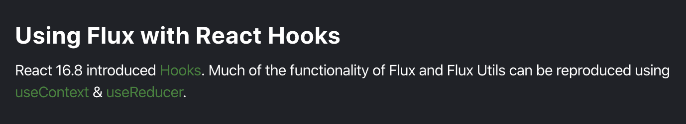

# STATE-MANAGEMENT

总结起来就两种方式：

* 外部 store，通过事件修改状态

  * redux

  * EventBus

  * vuex

* 状态提升（Context）

  * unstated-next

  * unstated

## redux

1. reducer 必须是纯函数？

    redux 让 reducer 必须是纯函数，也和 React 的 state 的 set 有关，必须是一个新的对象，这样有很多好处：可预测性、可维护、组织方便…… 

    其实 reducer 不纯也可以，vue 因为是响应式的，我们先想一下为什么 vue2 要 hack 那几个数组方法

    对象的话可以在一开始把所有属性都写好，附好初始值，而数组的长度是变化的（数组的“属性”（0、1、2……））不能提前知道，新添加的就不是响应式的，所以只 hack 了数组的几个方法，而 vue3 使用 Proxy 后就没有这个问题

    我用 redux 实现了下类似 vuex 的状态管理工具，使用的 reducer 是不纯的，同样可以实现状态管理

    react 提倡单向数据流，flux 本身也是对 react 单向数据流的一种扩展，redux 是 flux 的一种实现

2. 异步的处理

    我们让 reducer 不纯，asyncReducer 同样也可以处理异步

    redux 使用 middleware 来处理副作用，reducer 要是纯函数，中间件通过拦截 action，查看 action 类型，函数的话（redux-thunk）就调用处理副作用，但等副作用处理完成后最终还是会派发一个对象类型的 action（一般 payload 是副作用的结果）

## unstated

unstated 方案本质上利用了 setState，但将 setState 与 UI 剥离，并可以很方便的注入到任何组件中。

好了，我们知道 hooks 提供了一种更简单的方式进行逻辑复用

所以 hooks 出来后有很多使用 Context + useReducer 实现的简易的 Redux 库，比如：chrox（

## chrox（



用了两个 Context，分别创建 state 和 dispatch
其实用一个 Context 就可以（`<Context.Provider value={{ state, dispatch }}>`）

现在的问题就是副作用：http，定时器。。。

这些异步任务在 redux 中是通过中间件的方式解决

因为 redux 的 reducer 是一个纯函数，不能处理副作用

chrox（和其他类似的库）因为用的 redux 的方式实现，没有提供中间件的机制，如果处理副作用只能在 reducer 中处理，让 reducer 不纯（asyncReducer ？？？）

所以 chrox 只是 redux 用 hooks 的方式的简易的实现，要实现更完整的 1. 加入 middleware 的机制 2. 另一种方式（完全是 hooks）：unstated-next

## unstated-next

unstated-next 这个库只做了一件事情：提供 createContainer 将自定义 Hooks 封装为一个数据对象，提供 Provider 注入与 useContainer 获取 Store 这两个方法

纯 React Context 实现的版本可以看它的官网

unstated-next 就是将状态封装到 hooks 中，由于我们可以随时 setCount，所以早已天然解决了 reducer 无法异步的问题

如果你还是喜欢派发 action（对修改的描述）的方式，你可以把 useReducer 这个 hooks 传进去，当然现在完全没必要，不如换成 redux

一个不是问题的问题：太多的 Provider 了

可以参考 combineReducer 对 Provider 进行合并成一个单一的 Provider，获取状态只要拿到对应 Context 就可以

可以看看 reunx 🙈

但这样其实还是有很多嵌套的 Provider，React Devtool 调试就很难

```js
const combineProvider = (...Providers) => Providers.reduce(
  (Acc, Cur) => ({ children }) => (
    <Cur>
      <Acc>
        {children}
      </Acc>
    </Cur>
  ),
  ({ children }) => (<>{children}</>),
)

const Provider = combineProvider(Counter.Provider, Timer.Provider, Theme.Provider)
```

还有一种方式：把 hooks combine 成一个 hook，但这样就有全局污染的问题，还不如上一种


## Available Scripts

```bash
$ yarn dev
$ yarn build
```
